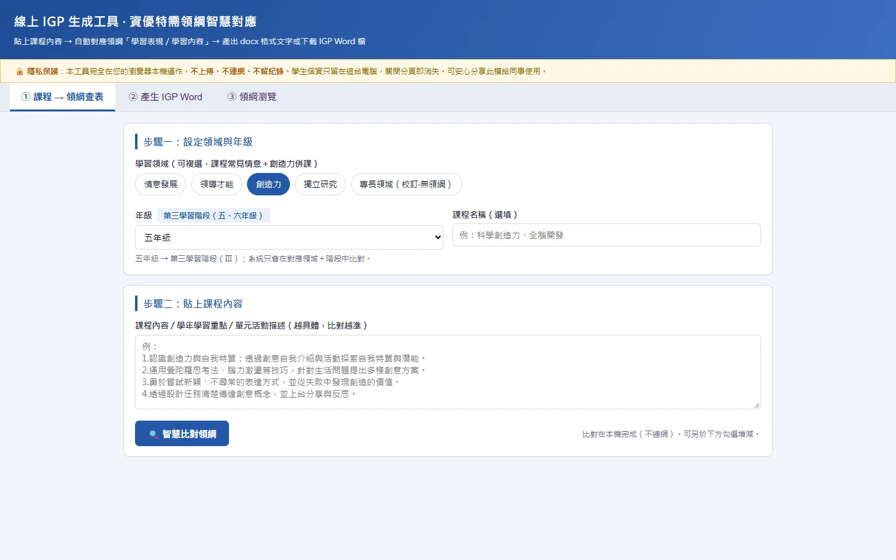

# 線上 IGP 生成工具｜資優特需領綱智慧對應

線上網站：https://shuan14408-ops.github.io/igp/

協助資優班老師撰寫 IGP（個別輔導計畫）的網頁工具。貼上課程內容，就能自動找出對應的資優特需領綱學習表現與學習內容，並直接產生 IGP Word 檔。

## 設計理念

- **省下翻領綱的時間**：撰寫 IGP 時，老師常要一條一條翻閱領綱、複製貼上學習表現。這個工具會依照學習領域與年級，在對應的學習階段中比對課程內容，排序出建議的領綱條目。
- **條目原文照錄，避免錯字**：領綱條目一律從資料庫原文帶出，系統只負責建議要挑哪幾條，不會重新改寫文字，避免錯字或學習階段錯置。
- **老師保有最後決定權**：系統自動勾選建議項目，老師可以自行增減，產生的文字可以直接複製貼回課程計畫。
- **隱私優先**：工具完全在瀏覽器本機執行，沒有伺服器、不連網、不上傳。學生資料只留在老師自己的電腦上，關閉分頁就消失。

## 功能

1. **課程 → 領綱查表**：選擇學習領域（可複選）與年級，貼上課程內容，智慧比對對應的學習表現與學習內容。
2. **產生 IGP Word**：填入學生基本資料與課程區塊，下載 .docx 格式的 IGP 文件。
3. **領綱瀏覽**：依領域與學習階段，查看全部領綱條目。

## 資料來源

- 十二年國民基本教育資賦優異相關之特殊需求領域課程綱要（情意發展、領導才能、創造力、獨立研究）
- 共收錄學習表現 699 條、學習內容 307 條

## 技術

- HTML / CSS / JavaScript（無框架、無伺服器）
- 在瀏覽器中直接產生 Word（.docx）檔案
- 部署於 GitHub Pages

> 本 repo 中的範本與範例皆不含任何真實學生資料。
